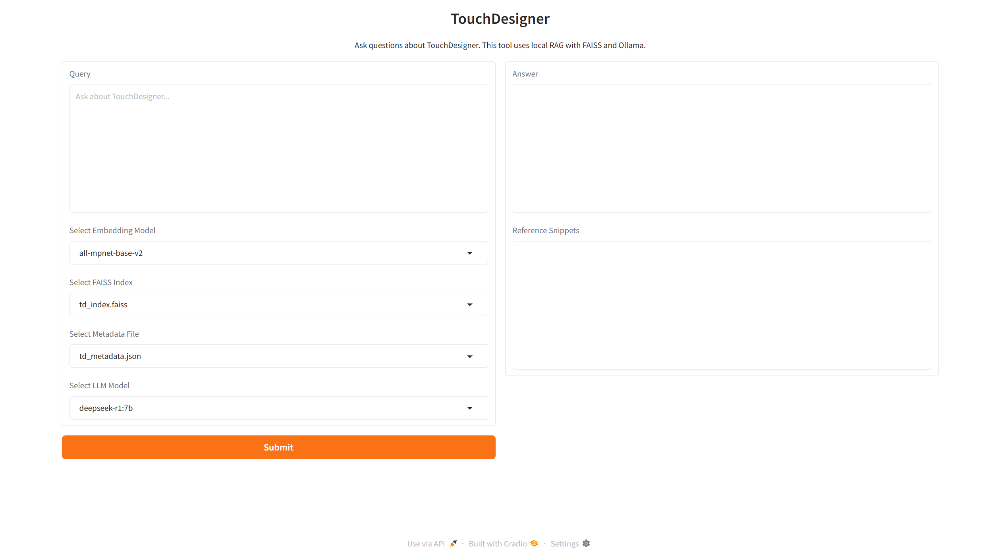
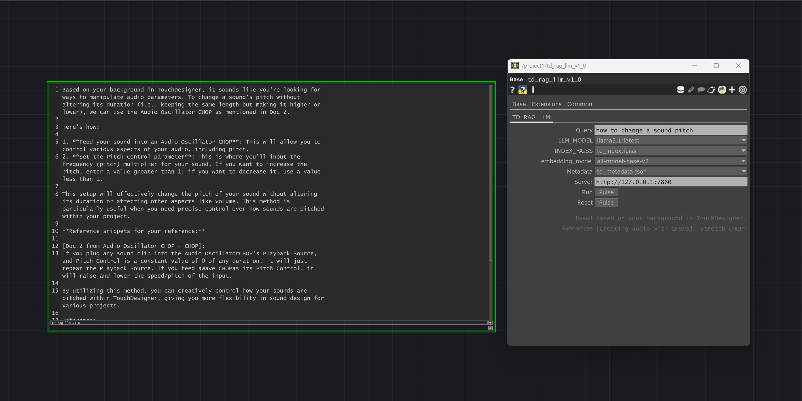

### TouchDesigner RAG

A local Retrieval-Augmented Generation (RAG) system for answering questions about TouchDesigner using wiki pages, tutorials, and other structured or semi-structured content. Powered by FAISS and local LLMs via [Ollama](https://ollama.com/).

---

#### Installation

- Install the required environment.
- Make sure [Ollama](https://ollama.com/) is installed and running.

---

#### Files

- `model/` - Precompiled FAISS index and metadata files. Latest precompiled FAISS index is available at: [huggingface.co/imjj/touchdesigner-rag-wiki-index](https://huggingface.co/imjj/touchdesigner-rag-wiki-index)
- `scripts/` - All Python scripts for preprocessing, embedding, and launching the app.
- `td/` - Contains components for use inside TouchDesigner.

---

#### Preprocess Raw HTML (wiki_cleaner.py)

This script is used to chunk TouchDesigner wiki HTML pages, typically found under:

```
Derivative\TouchDesigner\Samples\Learn\OfflineHelp\https.docs.derivative.ca
```

```bash
python wiki_cleaner.py \
  --input_dir data/raw_html \
  --output_dir data/cleaned/docs \
  --jsonl data/cleaned/chunks.jsonl
```

---

#### Build Embeddings + FAISS Index (build_embeddings.py)

This script is used to generate a FAISS vector index from the JSONL chunks using a specified embedding model.

```bash
python build_embeddings.py \
  --chunks_path data/cleaned/chunks.jsonl \
  --index_path model/td_index.faiss \
  --metadata_path model/td_metadata.json \
  --embedding_model all-mpnet-base-v2
```

---

#### Launch the Gradio App (app.py)

This script launches the Gradio web interface for querying the RAG system.

```bash
cd scripts
python app.py
```

Then visit [http://127.0.0.1:7860](http://127.0.0.1:7860) in your browser.



---

#### Use Inside TouchDesigner (Optional)

After launching the Gradio app, you can use the `.tox` component by dragging `td_rag_v1.0.tox` into your TouchDesigner network to:

- input your question directly inside TD
- trigger the RAG-based LLM to respond automatically
- view answers and references without leaving TouchDesigner



`td_rag_v1.0.tox`
- Make sure the Gradio app is running in the background.
- Press `Reset` to retrieve the available models from the backend before running.
- Enter your question in the `Query` field and press `Run` to fetch the result.

---

#### Notes and Limitations
<details>
<summary>Precompiled Data</summary>
The included FAISS index and metadata are built exclusively from the offline TouchDesigner wiki (`Samples\Learn\OfflineHelp`). All documents were automatically extracted and chunked without thorough manual review.
You're encouraged to refine the dataset or expand it by incorporating other sources (e.g., forums, tutorials). A more curated version may be released in future updates.
</details>
<details>
<summary>LLM Prompt Design</summary>
The current LLM system prompt is a basic template aimed at guiding the model's reasoning. Feel free to adapt or enhance it to better fit your technical needs or creative workflow.
</details>

---

#### Requirements

- Python 3.10+
- Ollama installed and running locally

---

#### License

This project is licensed under the MIT License.

**Notes:**
- The precompiled index was generated from the offline TouchDesigner documentation located in `Samples/Learn/OfflineHelp`. This content remains the property of Derivative Inc. and is used here for educational and personal purposes only.
- The included `.tox` component was created using the TouchDesigner Non-Commercial Edition. Users are responsible for ensuring compliance with their own TouchDesigner license (Commercial, Educational, or Non-Commercial).
- This project uses open-source libraries including FAISS, SentenceTransformers, and Gradio. It also integrates with large language models (LLMs) served via [Ollama](https://ollama.com/), which are subject to their respective licenses.